

# EzyRagdoll [](https://github.com/gamedev-uv/EzyRagdoll/blob/main/LICENSE)
A small package which makes adding ragdolls to your game easier!

---

# Table of Contents

- [💿 Installation](#installation)
- [Dependencies](#dependencies)
- [Ragdoll Creator](#ragdoll-creator)
- [Rig Template Creator](#rig-template-creator)
- [Ragdoll.cs](#ragdollcs)

---

# 💿 Installation
:warning: This package requires the [**EzyInspector**](https://github.com/gamedev-uv/EzyInspector) & [**EzyReflection**](https://github.com/gamedev-uv/EzyReflection) package in order to function. Make sure you install that package before installing this one.

Through the [**Unity Package Manager**](https://docs.unity3d.com/Manual/upm-ui-giturl.html) using the following Git URLs:
```
https://github.com/gamedev-uv/EzyReflection.git
```

```
https://github.com/gamedev-uv/EzyInspector.git
```

```
https://github.com/gamedev-uv/EzyRagdoll.git
```


# Dependencies 
 - [**EzyInspector**](https://github.com/gamedev-uv/EzyInspector) - Used for drawing the Buttons in the Inspector 
 - [**EzyReflection**](https://github.com/gamedev-uv/EzyReflection)- Used for creating the ragdoll through the internal [**RagdollBuilder**](https://github.com/Unity-Technologies/UnityCsReference/blob/master/Editor/Mono/RagdollBuilder.cs) class 

# Ragdoll Creator

## Step 1 : Opening the Ragdoll Creator Window

- In Unity, navigate to the top menu bar.
- Select `UV` > `Ragdoll Creator`.

This will open the Ragdoll Creator window, allowing you to create and configure your ragdoll.

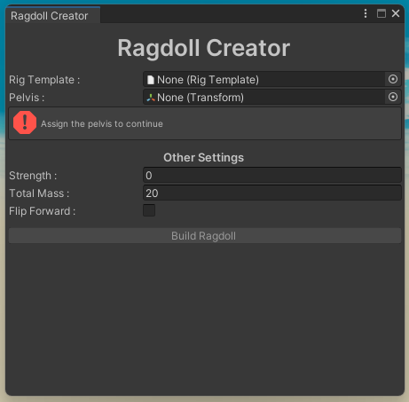

## Step 2 : Assign your Character's Rig Pelvis 
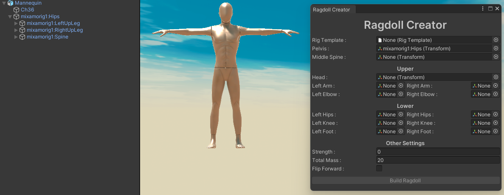

This is typically the container for the rig. The screenshot includes a sample [**Mixamo**](https://www.mixamo.com/) rig. 

## Step 3 : Assign other bones
> ### Manual Assignment
Drag and drop to assign all the bones manually 
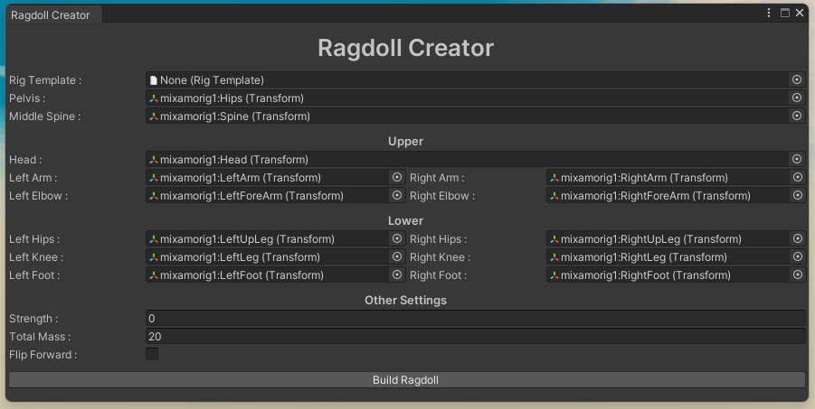


> ### Rig Template (Auto loading)
Let's say you already made a rig template for the current type of rig, you can directly use that instead of painstakingly assigning all bones manually.

- Drag and drop your `RigTemplate` into the `Rig Template` field.
- Click `Load Bones` to load the bones from the selected `RigTemplate`. (Make sure the pelvis is assigned else the LoadBones button won't show up)\
You can also make manual changes after auto-loading.
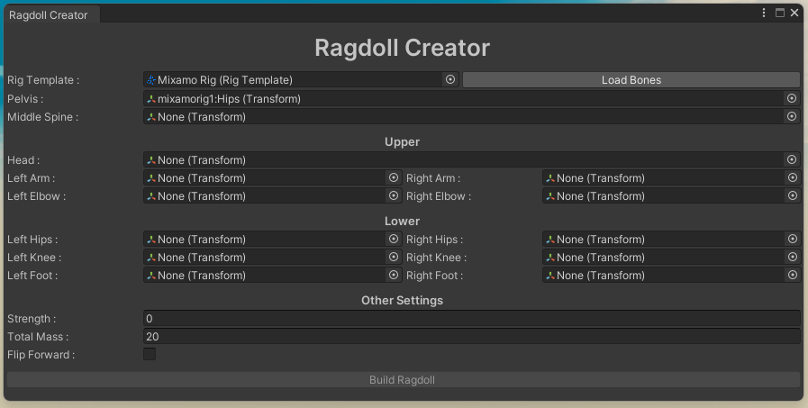
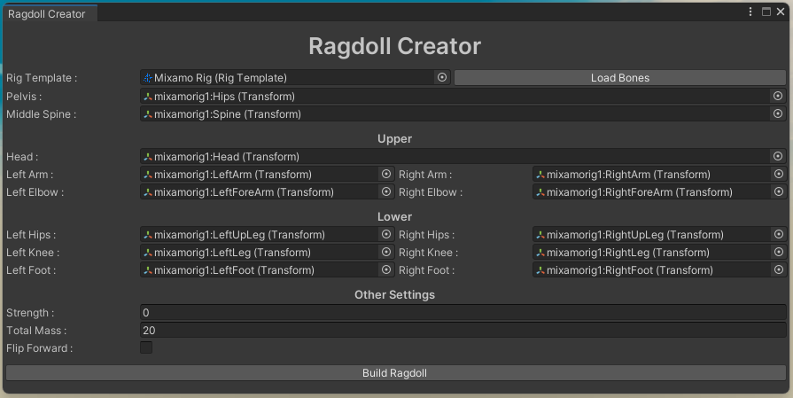

## Step 4 : Configure Ragdoll Settings

In the Ragdoll Creator window, you can configure the following settings:

- **Strength**: The strength of the ragdoll.
- **Total Mass**: The total mass of the ragdoll.
- **Flip Forward**: Whether the ragdoll should be flipped forward.

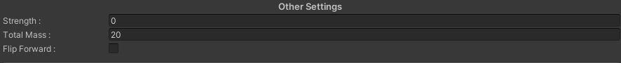

## Step 5 : Build Ragdoll

- Ensure all bones are valid and configured.
- Click the `Build Ragdoll` button to create the ragdoll.

And that's it your character should now have a working ragdoll!

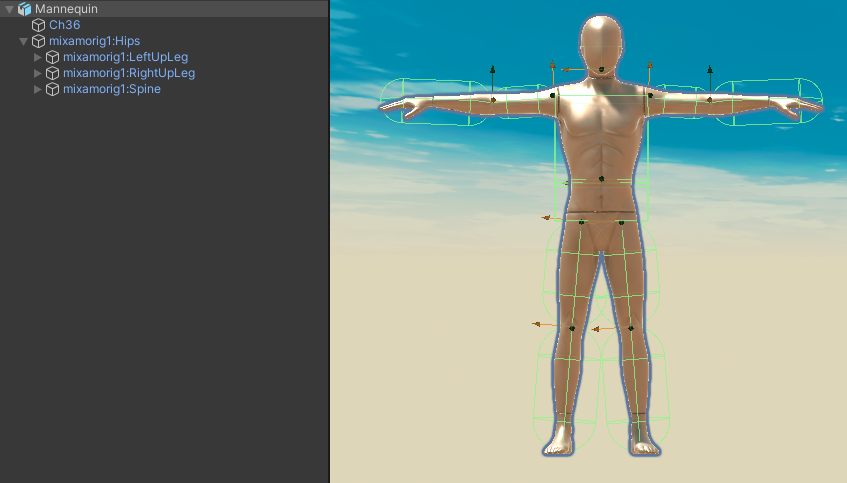

# Rig Template Creator
## Step 1 : Opening the Rig Template Creator Window

- In Unity, navigate to the top menu bar.
- Select `UV` > `Rig Template Creator`.

This will open the Rig Template Creator window and you should see a window similar to the one in the screenshot:

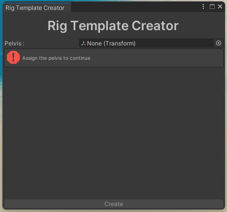

## Step 2 : Assign your Character's Rig Pelvis 
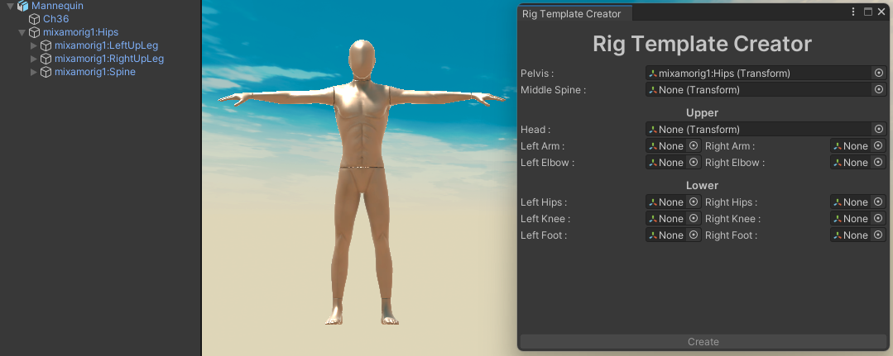

This is typically the container for the rig. The screenshot includes a sample [**Mixamo**](https://www.mixamo.com/) rig. 

## Step 3 : Assign Other Bones

Then you will see several fields where you can assign the other bones for the rig template. The required bones are:

- **Pelvis**
- **Middle Spine**

- Upper 
    - **Head**
    - **Left Arm**
        - **Left Elbow**
    - **Right Arm**
        - **Right Elbow**

- Lower
    - **Left Hips**
        - **Left Knee**
        - **Left Foot**
    - **Right Hips**
        - **Right Knee**
        - **Right Foot**

Drag and drop the appropriate transforms from the hierarchy into these fields.\
At the end it should look something like this :

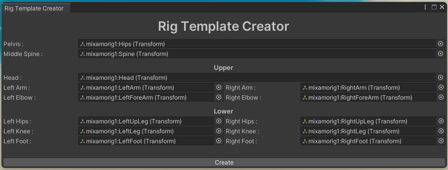


## Step 4 : Create the Rig Template

Once you have assigned all the necessary transforms, click the `Create` button at the bottom of the window.\
When you click `Create` a new `RigTemplate (Scriptable Object)` will be created under the `Assets` folder with an unique name based on the pelvis transform's name.

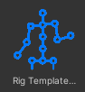
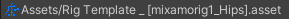

## :left_speech_bubble: The Create button is disabled?
The button will be enabled when all the bones are valid.

Conditions for the bones to be valid 
 - Should be assigned 
 - Should be under the **Pelvis Transform** (The pelvis itself would of course be the same object)

You will also get a HelpBox in the window itself whenever a bone is invalid. Something like this :
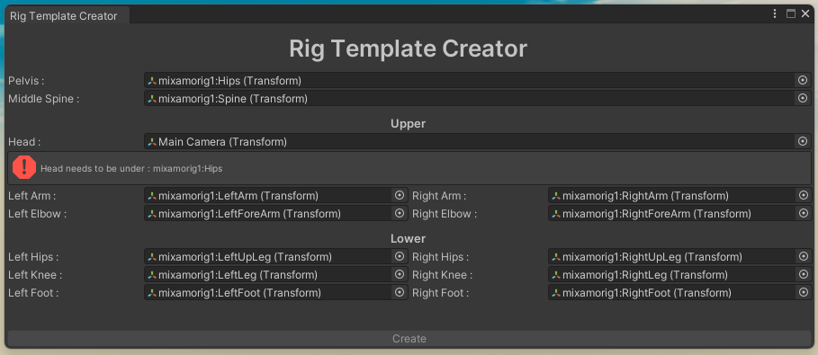

# Ragdoll.cs
## Data Members

| Member | Type | Description |
|--------|------|-------------|
| `DisableRagdollAtStart` | `bool` | Whether the ragdoll is to be turned off at the start. |
| `ControlColliders` | `bool` | Whether the colliders are controlled by the ragdoll or not. |
| `ChildrenBodies` | `Rigidbody[]` | All the rigidbodies on the children under this object. |
| `ChildrenColliders` | `Collider[]` | All the colliders on the children under this object. |
| `OnRagdollEnabled` | `UnityEvent` | Event which is called when the ragdoll is enabled. |
| `OnRagdollDisabled` | `UnityEvent` | Event which is called when the ragdoll is disabled. |

## Member Methods 

### `FindReferences`

- `public void FindReferences()`
Finds all the rigidbodies and colliders in the children of the GameObject. It stores them in `ChildrenBodies` and `ChildrenColliders`.

### `SetRagdoll`

- `public void SetRagdoll(bool activationState)`
Sets the activation state of the ragdoll. Enables or disables the rigidbodies and colliders based on the `activationState`.
    - `activationState` (`bool`): The desired activation state of the ragdoll (`true` to enable, `false` to disable).

### `EnableRagdoll`

- `public void EnableRagdoll()`
Activates the ragdoll and invokes the `OnRagdollEnabled` event.

### `DisableRagdoll`

- `public void DisableRagdoll()`
Deactivates the ragdoll and invokes the `OnRagdollDisabled` event.

### `AddForce`

- `public void AddForce(float force)`
Activates the ragdoll and adds an explosive force to it at the object's position.
  - `force` (`float`): The magnitude of the force to be added.

- `public void AddForce(Vector3 force, ForceMode forceMode = ForceMode.Impulse)`
Activates the ragdoll and adds a specified force to it.
    - `force` (`Vector3`): The force to be applied.
    - `forceMode` (`ForceMode`, optional): The mode to use when applying the force (default is `ForceMode.Impulse`).

- `public void AddForce(float force, Vector3 forcePoint, ForceMode forceMode = ForceMode.Impulse)`
Activates the ragdoll and adds an explosive force to it at the specified point.
    - `force` (`float`): The magnitude of the force to be applied.
    - `forcePoint` (`Vector3`): The point at which the force will be applied.
    - `forceMode` (`ForceMode`, optional): The mode to use when applying the force (default is `ForceMode.Impulse`).


## Usage Example

```csharp
using UnityEngine;
using UV.EzyRagdoll;
using System.Collections;

public class RagdollExample : MonoBehaviour
{
    [SerializeField] private Ragdoll _ragdoll;

    IEnumerator Start()
    {
        // Find and initialize references to the child components
        _ragdoll.FindReferences();

        // Enable the ragdoll
        _ragdoll.EnableRagdoll();

        // Add a force to the ragdoll
        _ragdoll.AddForce(100f);

        // Disable the ragdoll after 5 seconds
        yield return new WaitForSeconds(5);
        _ragdoll.DisableRagdoll();
    }
}
