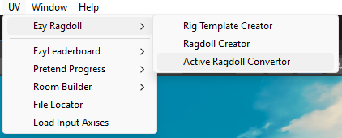
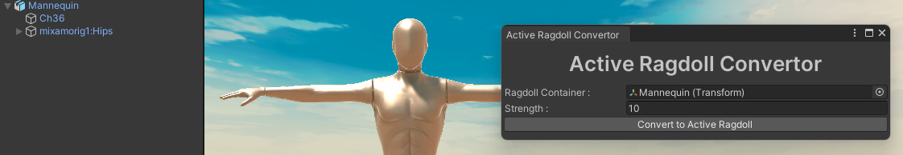
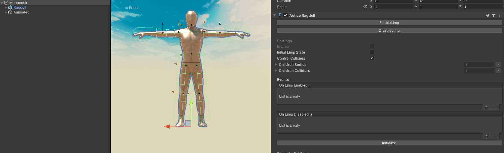



# EzyRagdoll [](https://github.com/gamedev-uv/EzyRagdoll/blob/main/LICENSE)
A small package which makes adding ragdolls to your game easier!

---

# Table of Contents

- [💿 Installation](#installation)
- [Dependencies](#dependencies)
- [Ragdoll Creator](#ragdoll-creator)
- [Rig Template Creator](#rig-template-creator)
- [Active Ragdoll Convertor](#active-ragdoll-convertor)
- [Ragdoll.cs](#ragdollcs)

---

# 💿 Installation
:warning: This package requires the [**EzyInspector**](https://github.com/gamedev-uv/EzyInspector) & [**EzyReflection**](https://github.com/gamedev-uv/EzyReflection) package in order to function. Make sure you install that package before installing this one.

Through the [**Unity Package Manager**](https://docs.unity3d.com/Manual/upm-ui-giturl.html) using the following Git URLs:
```
https://github.com/gamedev-uv/EzyReflection.git
```

```
https://github.com/gamedev-uv/EzyInspector.git
```

```
https://github.com/gamedev-uv/EzyRagdoll.git
```


# Dependencies 
 - [**EzyInspector**](https://github.com/gamedev-uv/EzyInspector) - Used for drawing the Buttons in the Inspector 
 - [**EzyReflection**](https://github.com/gamedev-uv/EzyReflection)- Used for creating the ragdoll through the internal [**RagdollBuilder**](https://github.com/Unity-Technologies/UnityCsReference/blob/master/Editor/Mono/RagdollBuilder.cs) class 

# Ragdoll Creator

## Step 1 : Opening the Ragdoll Creator Window

- In Unity, navigate to the top menu bar.
- Select `UV` > `Ragdoll Creator`.

This will open the Ragdoll Creator window, allowing you to create and configure your ragdoll.


## Step 2 : Assign your Character's Rig Pelvis 


This is typically the container for the rig. The screenshot includes a sample [**Mixamo**](https://www.mixamo.com/) rig. 

## Step 3 : Assign other bones
> ### Manual Assignment
Drag and drop to assign all the bones manually 


> ### Rig Template (Auto loading)
Let's say you already made a rig template for the current type of rig, you can directly use that instead of painstakingly assigning all bones manually.

- Drag and drop your `RigTemplate` into the `Rig Template` field.
- Click `Load Bones` to load the bones from the selected `RigTemplate`. (Make sure the pelvis is assigned else the LoadBones button won't show up)\
You can also make manual changes after auto-loading.


## Step 4 : Configure Ragdoll Settings

In the Ragdoll Creator window, you can configure the following settings:

- **Strength**: The strength of the ragdoll.
- **Total Mass**: The total mass of the ragdoll.
- **Flip Forward**: Whether the ragdoll should be flipped forward.


## Step 5 : Build Ragdoll

- Ensure all bones are valid and configured.
- Click the `Build Ragdoll` button to create the ragdoll.

And that's it your character should now have a working ragdoll!


# Rig Template Creator
## Step 1 : Opening the Rig Template Creator Window

- In Unity, navigate to the top menu bar.
- Select `UV` > `Rig Template Creator`.

This will open the Rig Template Creator window and you should see a window similar to the one in the screenshot:


## Step 2 : Assign your Character's Rig Pelvis 


This is typically the container for the rig. The screenshot includes a sample [**Mixamo**](https://www.mixamo.com/) rig. 

## Step 3 : Assign Other Bones

Then you will see several fields where you can assign the other bones for the rig template. The required bones are:

- **Pelvis**
- **Middle Spine**

- Upper 
    - **Head**
    - **Left Arm**
        - **Left Elbow**
    - **Right Arm**
        - **Right Elbow**

- Lower
    - **Left Hips**
        - **Left Knee**
        - **Left Foot**
    - **Right Hips**
        - **Right Knee**
        - **Right Foot**

Drag and drop the appropriate transforms from the hierarchy into these fields.\
At the end it should look something like this :


## Step 4 : Create the Rig Template

Once you have assigned all the necessary transforms, click the `Create` button at the bottom of the window.\
When you click `Create` a new `RigTemplate (Scriptable Object)` will be created under the `Assets` folder with an unique name based on the pelvis transform's name.


## :left_speech_bubble: The Create button is disabled?
The button will be enabled when all the bones are valid.

Conditions for the bones to be valid 
 - Should be assigned 
 - Should be under the **Pelvis Transform** (The pelvis itself would of course be the same object)

You will also get a HelpBox in the window itself whenever a bone is invalid. Something like this :


# Active Ragdoll Convertor
In order to convert a pre existing ragdoll to an active ragdoll simply follow these steps :

## Step 1 : Open the `Active Ragdoll Convertor` window by navigating to `UV` > `Ezy Ragdoll` >`Active Ragdoll Convertor`


## Step 2 : Drag your character in into the Ragdoll Container field
## Step 3 : Adjust the strength (Optional) 
## Step 4 : Click the `Convert to Active Ragdoll` button


## Step 5 : Now select the newly formed Object and click the `Initialize` button under the Active Ragdoll component


And that's it you can now assign an Animator on the `Character/Animated` object and the active ragdoll will now try to replicate!


# BaseRagdoll.cs

`BaseRagdoll` is the base ragdoll script that controls the limp state of a ragdoll by enabling or disabling its rigidbodies and colliders.

## Fields

| Name                 | Type          | Description                                                              |
|----------------------|---------------|--------------------------------------------------------------------------|
| `IsLimp`             | `bool`        | Whether the ragdoll is currently limp.                                   |
| `InitialLimpState`   | `bool`        | Whether the ragdoll should start limp on `Awake()`.                      |
| `ControlColliders`   | `bool`        | Whether the colliders should be enabled/disabled along with the ragdoll. |
| `ChildrenBodies`     | `Rigidbody[]` | All child rigidbodies, auto-collected by `FindReferences()`.            |
| `ChildrenColliders`  | `Collider[]`  | All child colliders, auto-collected by `FindReferences()`.              |
| `OnLimpEnabled`      | `UnityEvent`  | Invoked when limp is enabled.                                           |
| `OnLimpDisabled`     | `UnityEvent`  | Invoked when limp is disabled.                                          |


## Methods

### ❇️ `void FindReferences()`

Finds and stores all child rigidbodies and colliders under the GameObject. Automatically called by Unity if not manually assigned.

### ❇️ `void EnableLimp()`

Sets the ragdoll to limp and invokes `OnLimpEnabled`.

### ❇️ `void DisableLimp()`

Disables limp and invokes `OnLimpDisabled`.

### ❇️ `void SetLimpState(bool isLimp)`

Enables or disables the limp state of the ragdoll.  
- `isLimp`: `true` to make the ragdoll limp, `false` to disable limp state.


# Ragdoll.cs : [`BaseRagdoll`](./BaseRagdoll.cs)

`Ragdoll` is a concrete implementation of `BaseRagdoll` that actively manages the physics and collision state of child rigidbodies and colliders when switching limp states.

## Methods

### ❇️ `void Reset()`

Unity callback that is invoked when the component is reset.  
Calls `FindReferences()` to populate rigidbody and collider arrays.

### ❇️ `void SetLimpState(bool limpState)`

Overrides `BaseRagdoll`'s method to manage physical and collision state of children.

- `limpState`: `true` to enable ragdoll physics, `false` to disable.

#### Behaviour:
- Sets all child `Rigidbody` components to `isKinematic = !limpState`.
- If `ControlColliders` is enabled, enables/disables each collider based on the limp state.
- The root GameObject’s own collider is **not** affected by the toggle.


# ActiveRagdoll.cs : [`BaseRagdoll`](./BaseRagdoll.cs)

`ActiveRagdoll` extends `BaseRagdoll` to follow an animated object using physics, allowing hybrid behaviour between animation and ragdoll simulation.  
It interpolates rigidbody velocities to follow corresponding animated bones in real time when not limp.

## Fields

| Name              | Type               | Description                                                                 |
|-------------------|--------------------|-----------------------------------------------------------------------------|
| `FollowStrength`  | `float`            | The follow strength used to match the ragdoll to the animated object.       |
| `RagdollRoot`     | `Transform`        | The root `Transform` of the ragdoll hierarchy.                              |
| `AnimatedRoot`    | `Transform`        | The root `Transform` of the animated hierarchy.                             |
| `Joints`          | `ConfigurableJoint[]` | The joints used to simulate muscle-like movement.                        |
| `RagdollBones`    | `Transform[]`      | The bones of the ragdoll, mapped from `ChildrenBodies`.                    |
| `AnimatedBones`   | `Transform[]`      | The bones from the animated object that ragdoll bones follow.              |

## Methods

### ❇️ `void Reset()`

Unity callback that runs when the component is reset.  
Calls `Initialize()` to populate internal references.

### ❇️ `void Initialize(Transform ragdollContainer, Transform animatedContainer)`

Initialises the ragdoll using a specified ragdoll root and animated root.

- `ragdollContainer`: The transform that contains all ragdoll bones.
- `animatedContainer`: The transform that contains all animated bones.

### ❇️ `void Initialize()`

Initialises internal references.  
- Finds all rigidbodies and colliders using `FindReferences()`.  
- Configures them using `InitializeRigidbodies()`.

### ❇️ `void FindReferences()`

Finds and stores:
- Child rigidbodies and colliders via base method.
- All bone pairs under `RagdollRoot` and `AnimatedRoot`.
- Corresponding joints for each bone.

### ❇️ `void SetLimpState(bool limpState)`

Overrides `BaseRagdoll.SetLimpState`.  
- Increases drag and angular drag when not limp to reduce jitter.  
- Reduces them when limp to allow full physical response.

### ❇️ `void InitializeRigidbodies()`

Configures each rigidbody:
- `drag = 20`, `angularDrag = 1`
- `isKinematic = false`
- Interpolation and collision detection enabled

### 🔁 `void FixedUpdate()`

Performs physics-based following of the animated bones.  
- Calculates target velocity and angular velocity from animated bones.
- Interpolates current velocity and angular velocity towards targets using `FollowStrength`.

### 🔧 `string GetPath(Transform root, Transform target)`

Utility method that constructs a hierarchical path from `root` to `target`.  
Used to match ragdoll bones to corresponding animated bones.